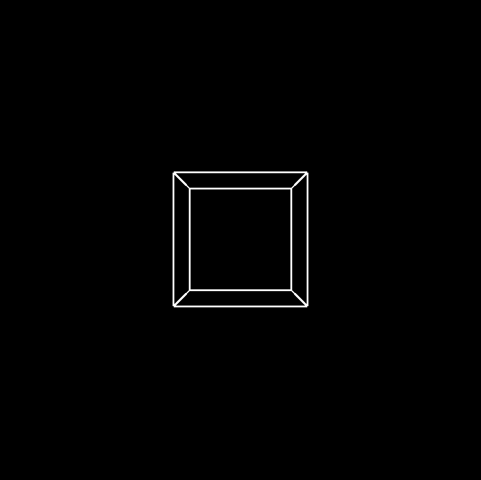

# p5-sketches

a collection of p5.js sketches

<table>
  <tr>
    <td>
      <a href="/abc.js">abc</a>
    </td>
    <td>
      
    </td>
  </tr>
  <tr>
    <td>
      <a href="/brush-color-spectrum.js">brush-color-spectrum</a>
    </td>
    <td>
      
    </td>
  </tr>
  <tr>
    <td>
      <a href="/cube-pulse.js">cube-pulse</a>
    </td>
    <td>
      
    </td>
  </tr>
    <tr>
    <td>
      <a href="/echo.js">echo</a>
    </td>
    <td>
      
    </td>
  </tr>
  <tr>
    <td>
      <a href="/game-conway.js">game-conway</a>
    </td>
    <td>
      
    </td>
  </tr>
  <tr>
    <td>
      <a href="/glitch-windows.js">glitch-windows</a>
    </td>
    <td>
      
    </td>
  </tr>
  <tr>
    <td>
      <a href="/grid-circle.js">grid-circle</a>
    </td>
    <td>
      
    </td>
  </tr>
  <tr>
    <td>
      <a href="/grid-square-flex-height-width.js">grid-square-flex-height-width</a>
    </td>
    <td>
      
    </td>
  </tr>
  <tr>
    <td>
      <a href="/grid-with-cascade.js">grid-with-cascade</a>
    </td>
    <td>
      
    </td>
  </tr>
  <tr>
    <td>
      <a href="/grid-with-margins.js">grid-with-margins</a>
    </td>
    <td>
      
    </td>
  </tr>
  <tr>
    <td>
      <a href="/moving-letters-margin.js">moving-letters-margin</a>
    </td>
    <td>
      
    </td>
  </tr>
  <tr>
    <td>
      <a href="/snake-1.js">snake-1</a>
    </td>
    <td>
      
    </td>
  </tr>
  <tr>
    <td>
      <a href="/snake-2.js">snake-2</a>
    </td>
    <td>
      
    </td>
  </tr>
  <tr>
    <td>
      <a href="/words-tired.js">words-tired</a>
    </td>
    <td>
      
    </td>
  </tr>
  <tr>
    <td>
      <a href="/zigzag.js">zigzag</a>
    </td>
    <td>
      
    </td>
  </tr>
  <tr>
    <td>
      <a href="/3d-cubes-multi-rotate.js">3d-cubes-multi-rotate</a>
    </td>
    <td>
      
    </td>
  </tr>
  <tr>
    <td>
      <a href="/3d-cubes-nested-rotate.js">3d-cubes-nested-rotate</a>
    </td>
    <td>
      
    </td>
  </tr>
</table>
